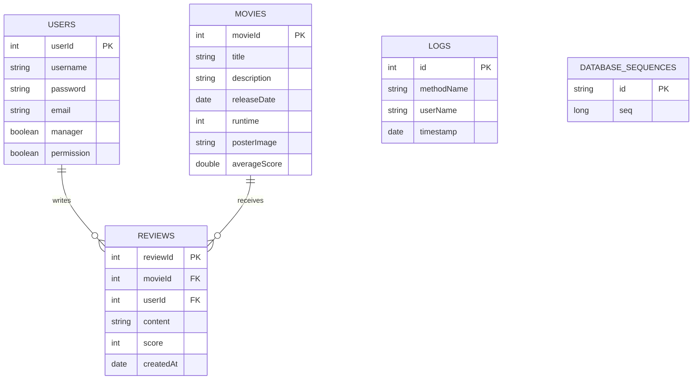

# 数据库结构图



```text
集合说明
1. users：用户集合，保存账号、邮箱、角色与权限信息
2. movies：电影集合，保存电影基础信息与平均评分
3. reviews：评论集合，按 movieId 和 userId 关联电影与用户
4. logs：操作日志集合，记录方法名、操作用户与时间
5. database_sequences：序列号集合，用于生成自增式业务 ID
```

```text
补充说明
- 本项目使用 MongoDB，严格来说是“集合结构”而不是传统关系型数据库的“表结构”
- 图中 FK 表示业务上的逻辑关联，不是 MongoDB 原生外键约束
- Review 实体中的 username、title、user、movie 属于运行时补充字段，不直接作为 reviews 集合的持久化主字段
```
