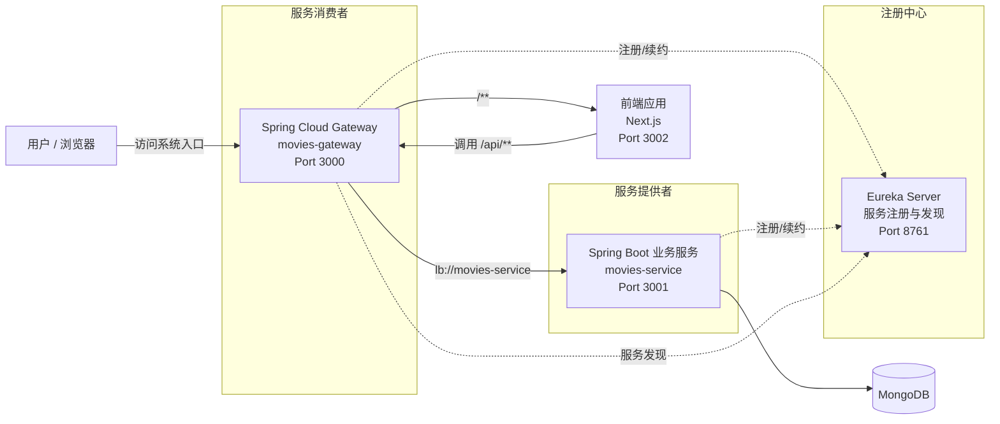
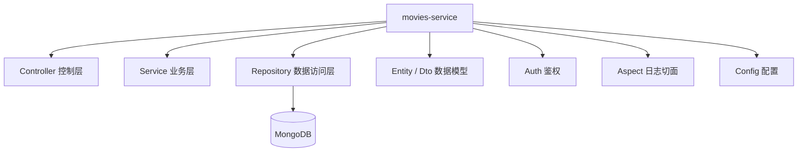

# 项目架构图

## 1. 微服务注册与调用关系图



## 2. movies-service 内部包结构图



```text
说明
1. Eureka Server 是服务注册中心，负责维护 movies-gateway 和 movies-service 的实例信息。
2. movies-service 是服务提供者，提供用户、电影、评论、日志等 REST API。
3. movies-gateway 是服务消费者和统一入口，通过 Eureka 发现并调用 movies-service。
4. 网关将 /** 转发到前端，将 /api/** 转发到 movies-service。
5. movies-service 通过 Repository 层访问 MongoDB。
```
