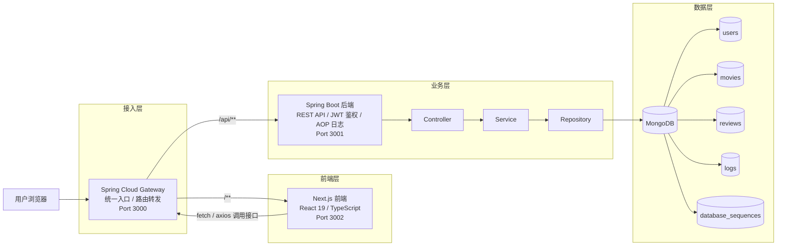

# 项目架构图



```text
访问路径说明
1. 用户统一访问网关入口：http://localhost:3000
2. 网关将 /api/** 转发到 Spring Boot 后端：http://localhost:3001
3. 网关将 /** 转发到 Next.js 前端：http://localhost:3002
4. 后端通过 MongoDB 完成用户、电影、评论、日志与序列号数据读写
```
