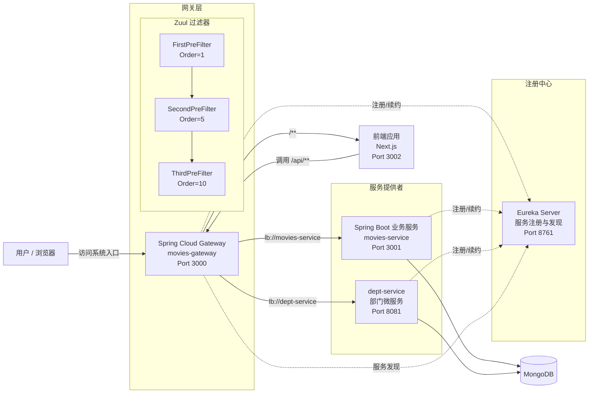
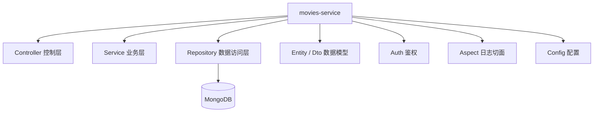
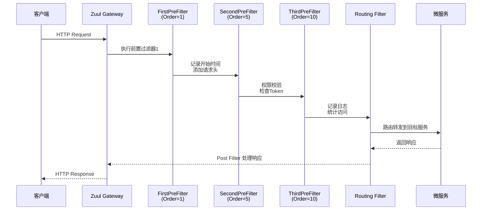

# 项目架构图

## 1. 微服务注册与调用关系图



## 2. movies-service 内部包结构图



```text
说明
1. Eureka Server 是服务注册中心，负责维护 movies-gateway、movies-service 和 dept-service 的实例信息。
2. movies-service 是服务提供者，提供用户、电影、评论、日志等 REST API。
3. dept-service 是部门微服务，提供部门相关的 REST API。
4. movies-gateway 是服务消费者和统一入口，基于 Zuul 实现路由转发。
5. 网关过滤器（FirstPreFilter/SecondPreFilter/ThirdPreFilter）按 Order 值顺序执行。
6. 网关将 /** 转发到前端，将 /api/** 转发到 movies-service，将 /dept/** 转发到 dept-service。
7. 微服务通过 Repository 层访问 MongoDB。
```

## 3. Zuul 过滤器执行流程图



```text
Zuul 过滤器说明
1. Pre Filters（前置过滤器）：在请求被路由之前执行
   - FirstPreFilter (Order=1)：最高优先级，记录请求开始时间，添加自定义请求头
   - SecondPreFilter (Order=5)：中等优先级，进行权限校验，检查 Token 有效性
   - ThirdPreFilter (Order=10)：最低优先级，记录请求日志，统计访问信息

2. Routing Filters（路由过滤器）：将请求路由到具体的服务实例

3. Post Filters（后置过滤器）：在路由到微服务之后执行，处理响应结果

4. Error Filters（错误过滤器）：在请求发生错误时执行
```
