# 项目目录结构图

```mermaid
flowchart TD
    A[Movies]

    A --> B[docs]
    B --> B1[project-overview.md]
    B --> B2[project-architecture.md]
    B --> B3[project-structure.md]
    B --> B4[database-schema.md]

    A --> C[frontend]
    C --> C1[app]
    C1 --> C11[about/page.tsx]
    C1 --> C12[community/page.tsx]
    C1 --> C13[components]
    C13 --> C131[AuthModal.tsx]
    C13 --> C132[Footer.tsx]
    C13 --> C133[Navbar.tsx]
    C1 --> C14[movies]
    C14 --> C141[id]
    C14 --> C142[page.tsx]
    C1 --> C15[reviews/page.tsx]
    C1 --> C16[globals.css]
    C1 --> C17[layout.tsx]
    C1 --> C18[page.tsx]
    C --> C2[components]
    C --> C3[lib]
    C --> C4[package.json]
    C --> C5[tsconfig.json]

    A --> D[eureka-server]
    D --> D1[src/main/java/edu/cuit/eurekaserver]
    D1 --> D11[EurekaServerApplication.java]
    D --> D2[src/main/resources]
    D2 --> D21[application.yml]
    D --> D3[pom.xml]

    A --> E[gateway]
    E --> E1[src/main/java/edu/cuit]
    E1 --> E11[moviesgateway/MoviesGatewayApplication.java]
    E1 --> E12[filter]
    E12 --> E121[LoggerPreFilter.java]
    E12 --> E122[AuthPreFilter.java]
    E12 --> E123[ParamCheckPreFilter.java]
    E --> E2[src/main/resources]
    E2 --> E21[application.yml]
    E --> E3[pom.xml]

    A --> H[dept-service]
    H --> H1[src/main/java/edu/cuit/dept]
    H1 --> H11[DeptServiceApplication.java]
    H1 --> H12[controller/DeptController.java]
    H1 --> H13[entity/Department.java]
    H --> H2[src/main/resources]
    H2 --> H21[application.yml]
    H --> H3[pom.xml]

    A --> F[movies-service]
    F --> F1[src/main/java/edu/cuit/yingpingsxitong]
    F1 --> F11[Aspect]
    F11 --> F111[OperationLogAspect.java]
    F1 --> F12[Auth]
    F12 --> F121[AdminOnly.java]
    F12 --> F122[AuthConstants.java]
    F12 --> F123[Authenticated.java]
    F12 --> F124[JwtAuthInterceptor.java]
    F12 --> F125[JwtService.java]
    F1 --> F13[Config]
    F13 --> F131[CorsConfig.java]
    F13 --> F132[DataInitializer.java]
    F13 --> F133[DatabaseSequence.java]
    F13 --> F134[RootAdminInitializer.java]
    F13 --> F135[SequenceGeneratorService.java]
    F13 --> F136[WebConfig.java]
    F1 --> F14[Controller]
    F14 --> F141[AuthApiController.java]
    F14 --> F142[LogApiController.java]
    F14 --> F143[MovieApiController.java]
    F14 --> F144[ReviewApiController.java]
    F14 --> F145[UserApiController.java]
    F1 --> F15[Dao]
    F1 --> F16[Dto]
    F16 --> F161[AuthResponse.java]
    F1 --> F17[Entity]
    F17 --> F171[Log.java]
    F17 --> F172[Movie.java]
    F17 --> F173[Review.java]
    F17 --> F174[User.java]
    F1 --> F18[Repository]
    F18 --> F181[LogRepository.java]
    F18 --> F182[MovieRepository.java]
    F18 --> F183[ReviewRepository.java]
    F18 --> F184[UserRepository.java]
    F1 --> F19[Service]
    F19 --> F191[LogService.java]
    F19 --> F192[MovieService.java]
    F19 --> F193[ReviewService.java]
    F19 --> F194[UserService.java]
    F1 --> F110[YingpingsxitongApplication.java]
    F --> F2[src/main/resources/application.properties]
    F --> F3[src/test/java]
    F --> F4[pom.xml]

    A --> G[config-server]
    G --> G1[src/main/java/edu/cuit/configserver]
    G1 --> G11[ConfigServerApplication.java]
    G --> G2[src/main/resources]
    G2 --> G21[application.yml]
    G --> G3[pom.xml]

    A --> H[根目录]
    G --> G1[pom.xml]
    G --> G2[mvnw / mvnw.cmd]
    G --> G3[docs]
```



```text
说明
1. 该图按模块展示了 frontend、eureka-server、gateway、movies-service、dept-service、config-server 的核心目录与包结构。
2. movies-service 的包结构体现了典型分层：Controller、Service、Repository、Entity、Config、Auth、Aspect。
3. gateway 模块包含 3 个 Zuul 前置过滤器：LoggerPreFilter(Order=1)、AuthPreFilter(Order=2)、ParamCheckPreFilter(Order=3)。
4. dept-service 是实验四新增的部门微服务，用于测试 Zuul 路由转发。
5. 图中省略了 node_modules、target、.next 等构建产物目录，只保留展示项目结构所需的核心内容。
```
